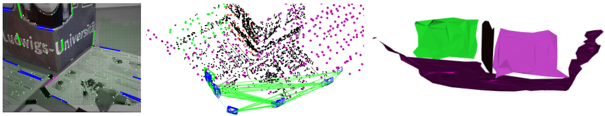

# PlanarSLAM
This repo proposes a RGB-D SLAM system specifically designed for structured environments and aimed at improved tracking and mapping accuracy by relying on geometric features that are extracted from the surrounding. More details can be found from our papers ([RGB-D](https://arxiv.org/abs/2010.07997) and [Monocular](https://arxiv.org/abs/2008.01963)).  

*The system will be released at the beginning of 2021 for celebrating the new year.  We hope everyone has a happy time and our world will get better soon.*

**Authors:** Yanyan Li, Raza Yunus, Nikolas Brasch, Nassir Navab and Federico Tombari




## License

PlanarSLAM is released under a [GPLv3 license](https://github.com/raulmur/ORB_SLAM2/blob/master/License-gpl.txt). 

For a closed-source version of ORB-SLAM2 for commercial purposes, please contact the authors: yanyan.li (at) tum.de.

If you use PlanarSLAM  in an academic work, please cite:
```
inproceedings{Li2020SSLAM,
  author = {Li, Yanyan and Yunus, Raza and Brasch, Nikolas and Navab, Nassir and Tombari, Federico},
  title = {RGB-D SLAM with Structural Regularities},
  year = {2020},
  booktitle = {arXiv:2010.07997},
 }
```

## 1. Prerequisites

We have tested the library in **ubuntu 16.04 and ubuntu 18.04**, but it should be easy to compile in other platforms. A powerful computer (e.g. i7) will ensure real-time performance and provide more stable and accurate results.

### C++11 or C++0x Compiler
We use the new thread and chrono functionalities of C++11.

### Pangolin
We use [Pangolin](https://github.com/stevenlovegrove/Pangolin) for visualization and user interface. Dowload and install instructions can be found at: https://github.com/stevenlovegrove/Pangolin.

### OpenCV
We use [OpenCV](http://opencv.org) and corresponding **OpenCV_Contrib** to manipulate images and features. Dowload and install instructions can be found at: http://opencv.org. **Tested with OpenCV 3.4.1**

### Eigen3
Required by g2o (see below). Download and install instructions can be found at: http://eigen.tuxfamily.org. **Required at least 3.1.0**.

### DBoW2 and g2o (Included in Thirdparty folder)
We use modified versions of the [DBoW2](https://github.com/dorian3d/DBoW2) library to perform place recognition and [g2o](https://github.com/RainerKuemmerle/g2o) library to perform non-linear optimizations. Both modified libraries (which are BSD) are included in the *Thirdparty* folder.

### PCL

We use [PCL](http://www.pointclouds.org/) to reconstruct and visualize mesh. Download and install instructions can be found at: https://github.com/ros-perception/perception_pcl. **Tested with PCL 1.7.0 and 1.9.0**.

1. https://github.com/PointCloudLibrary/pcl/releases

2. compile and install

   ```
   cd pcl 
   mkdir release 
   cd release
   
   cmake  -DCMAKE_INSTALL_PREFIX=/usr/local \ -DBUILD_GPU=ON -DBUILD_apps=ON -DBUILD_examples=ON \ -DCMAKE_INSTALL_PREFIX=/usr/local -DPCL_DIR=/usr/local/share/pcl  .. 
   
   make -j12
   sudo make install
   ```


## 2. Test the system

### Structural Public datasets

TUM RGB-D

ICL NUIM


### Test the system locally

```
./build.sh
```

*command for testing TUM-RGBD sequences* 

```
./Examples/RGB-D/Planar_SLAM Vocabulary/ORBvoc.txt Examples/RGB-D/TUM3.yaml PATH_TO_SEQUENCE_FOLDER .PATH_TO_SEQUENCE_FOLDER/ASSOCIATIONS_FILE

```
*command for testing ICL-NUIM sequences*

```
./Examples/RGB-D/Planar_SLAM Vocabulary/ORBvoc.txt Examples/RGB-D/ICL.yaml PATH_TO_SEQUENCE_FOLDER  PATH_TO_SEQUENCE_FOLDER/ASSOCIATIONS_FILE

```

----

## Citation
```
inproceedings{Li2020SSLAM,
  author = {Li, Yanyan and Yunus, Raza and Brasch, Nikolas and Navab, Nassir and Tombari, Federico},
  title = {RGB-D SLAM with Structural Regularities},
  year = {2020},
  booktitle = {arXiv:2010.07997},
 }
```
```
inproceedings{Li2020SSLAM,
  author = {Li, Yanyan and Brasch, Nikolas and Wang, Yida and Navab, Nassir and Tombari, Federico},
  title = {Structure-SLAM: Low-Drift Monocular SLAM in Indoor Environments},
  year = {2020},
  booktitle = {IEEE/RSJ International Conference on Intelligent Robots and Systems (IROS)},
 }
```

## Acknowledgement

ORB_SLAM2 and the corresponding community.

